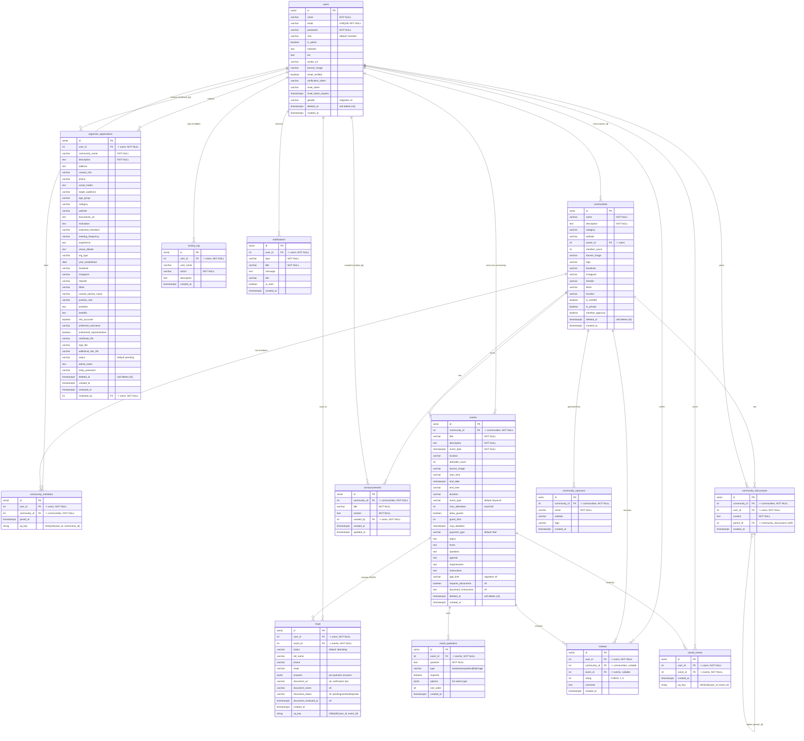

# Smart Connects — Database ERD (Entity Relationship Diagram)

> Source of truth: `backend/schema.sql` + incremental migrations `migration*.sql` (v2–v9).
> Database: **PostgreSQL**. This file documents all 14 tables and their relationships.
>
> **Rendered exports:** [`ERD.png`](ERD.png) (5343×4909) · [`ERD.svg`](ERD.svg) (vector, zoom-safe) · [`ERD.pdf`](ERD.pdf) (single-page print) · source: [`ERD.mmd`](ERD.mmd)

---

## Diagram

---

## Table Descriptions

### 1. `users`
Core account table for all users (members and admins).
- `role` defaults to `member`; admins are flagged via `is_admin` (and `role`).
- `email` is unique and used for login; `password` is hashed.
- Email verification + password reset flow uses `email_verified`, `verification_token`, `reset_token`, `reset_token_expires`.
- `gender` was added by migration v4 (not in `schema.sql`).
- `deleted_at` (migration v5) enables soft-delete / recycle-bin support.

**Relationships:** owns communities (`communities.owner_id`), joins communities (`community_members`), RSVPs to events (`rsvps`), writes `reviews`, submits `organizer_applications` (and can review them via `reviewed_by`), posts `announcements` and `community_discussions`, receives `notifications`, saves `saved_events`, and is logged in `activity_log`.

### 2. `communities`
Organizations/clubs that host events. One owner (`owner_id → users`).
- `member_count` is a denormalized counter (cached count of members).
- Social links (`facebook`, `instagram`, `linkedin`, `tiktok`) and branding (`banner_image`, `logo`).
- `is_private` + `member_approval` control membership visibility/approval.
- `category` is a free-text label (e.g. "Health & Wellness", "Technology", "Social Service").
- `deleted_at` (v5) for soft delete.

**Relationships:** belongs to an owner (`users`), has `community_members`, hosts `events`, receives `reviews`, has `announcements`, `community_discussions`, and `community_sponsors`.

### 3. `events`
Events hosted by a community. One event belongs to exactly one community.
- `event_date` is required; `end_date`/`start_time`/`end_time`/`duration` describe the schedule.
- `event_type`: `physical` / `virtual` (default `physical`); `payment_type` defaults to `free`.
- `max_attendees` is the seat limit; `attendee_count` is the denormalized live counter.
- Organizer content: `hosts`, `speakers`, `agenda`, `requirements`, `instructions`.
- Verification/eligibility fields (v9): `age_limit`, `requires_documents`, `document_instructions`.
- `topics` stores a JSON array of topic tags (used for category filtering).
- `deleted_at` (v5) for soft delete.

**Relationships:** hosted by a `community`, receives `rsvps`, defines `event_questions`, receives `reviews`, and is saved by users via `saved_events`.

### 4. `rsvps`
Attendance record linking a user to an event. A user can RSVP to the same event only once (`UNIQUE(user_id, event_id)`).
- `status`: `attending` / `not_attending`.
- `full_name`, `phone`, `email` capture attendee contact info.
- `answers` (JSONB, v7) stores answers to the event's custom registration questions: `{ "<questionId>": value, "<questionId>_name": originalFilename }` — file/image answers store the uploaded file URL plus its original name, and review status is stored as `<questionId>_status`.
- Document verification (v9): attendees upload `document_url`/`document_name` when the event `requires_documents`; organizers set `document_status` (`verified`/`rejected`) and `document_reviewed_at`.

**Relationships:** belongs to a `user` and an `event`.

### 5. `event_questions`
Custom registration questions an organizer adds to an event (v7).
- `type`: `text`, `textarea`, `select`, `file`, `image`.
- `options` (JSONB) holds choices for `select` questions; `sort_order` controls display order.
- `required` forces an answer before RSVP is accepted.

**Relationships:** belongs to an `event`; answers are stored in `rsvps.answers`.

### 6. `reviews`
Ratings/comments. A review can target a **community**, an **event**, or both (both FKs are nullable).
- `rating` is enforced `CHECK (rating >= 1 AND rating <= 5)`.

**Relationships:** written by a `user`; optionally about a `community` and/or `event`.

### 7. `community_members`
Membership join table between users and communities.
- `UNIQUE(user_id, community_id)` prevents duplicates.

**Relationships:** connects `users` ↔ `communities`.

### 8. `organizer_applications`
Application form for non-logged-in organizers to create a community (admin reviews and approves).
- Rich form data: org info, social media, contact person, activities/benefits, verification files (`certificate_file`, `logo_file`, `additional_doc_file`).
- `status`: `pending` → `approved`/`rejected`; `admin_notes` for feedback; `temp_password` for account creation on approval.
- `reviewed_by → users` (SET NULL if the reviewer is deleted); `reviewed_at` timestamp.
- `deleted_at` (v5) for soft delete.

**Relationships:** submitted by a `user` (the applicant), reviewed by a `user` (admin).

### 9. `announcements`
News posts published inside a community.
- `created_by → users` tracks the author; `updated_at` maintained on edit.

**Relationships:** belongs to a `community`, authored by a `user`.

### 10. `community_discussions`
Threaded discussions within a community.
- `parent_id` is a **self-reference** to `community_discussions.id` for replies (ON DELETE CASCADE).

**Relationships:** belongs to a `community`, posted by a `user`, supports nested replies.

### 11. `activity_log`
Audit trail of user actions (e.g. admin moderation events).
- `user_id` is nullable with `ON DELETE SET NULL`; `user_name` is denormalized so the log survives user deletion.

**Relationships:** optional reference to a `user`.

### 12. `notifications`
Per-user in-app notifications.
- `is_read` tracks read state; `link` deep-links to the relevant page.

**Relationships:** belongs to a `user`.

### 13. `saved_events`
Bookmark table (user saves events to view later).
- `UNIQUE(user_id, event_id)` prevents duplicates.

**Relationships:** connects `users` ↔ `events`.

### 14. `community_sponsors`
Sponsor listings for a community (name, website, logo).

**Relationships:** belongs to a `community`.

---

## Key Relationships Summary

| From | To | Cardinality | FK column | On Delete |
|---|---|---|---|---|
| communities | users | many → 1 | `owner_id` | CASCADE |
| events | communities | many → 1 | `community_id` | CASCADE |
| rsvps | users | many → 1 | `user_id` | CASCADE |
| rsvps | events | many → 1 | `event_id` | CASCADE |
| event_questions | events | many → 1 | `event_id` | CASCADE |
| reviews | users | many → 1 | `user_id` | CASCADE |
| reviews | communities | many → 0..1 | `community_id` | CASCADE |
| reviews | events | many → 0..1 | `event_id` | CASCADE |
| community_members | users | many → 1 | `user_id` | CASCADE |
| community_members | communities | many → 1 | `community_id` | CASCADE |
| organizer_applications | users | many → 1 | `user_id` | CASCADE |
| organizer_applications | users | many → 0..1 | `reviewed_by` | SET NULL |
| announcements | communities | many → 1 | `community_id` | CASCADE |
| announcements | users | many → 1 | `created_by` | CASCADE |
| community_discussions | communities | many → 1 | `community_id` | CASCADE |
| community_discussions | users | many → 1 | `user_id` | CASCADE |
| community_discussions | community_discussions | many → 0..1 | `parent_id` (self) | CASCADE |
| activity_log | users | many → 0..1 | `user_id` | SET NULL |
| notifications | users | many → 1 | `user_id` | CASCADE |
| saved_events | users | many → 1 | `user_id` | CASCADE |
| saved_events | events | many → 1 | `event_id` | CASCADE |
| community_sponsors | communities | many → 1 | `community_id` | CASCADE |

---

## Notable Conventions

- **Soft delete (v5):** `users`, `communities`, `events`, and `organizer_applications` have a nullable `deleted_at`; queries filter on `deleted_at IS NULL` rather than hard-deleting.
- **Denormalized counters:** `communities.member_count` and `events.attendee_count` are cached counters updated alongside writes.
- **JSONB usage:** `rsvps.answers` (registration answers + file review status), `event_questions.options` (select choices), `events.topics` (tags).
- **Unique constraints** enforce one-row-per-pair on `rsvps`, `community_members`, and `saved_events`.
- **Idempotent migrations:** every migration uses `IF NOT EXISTS` / `ADD COLUMN IF NOT EXISTS` so they can be re-run safely.
