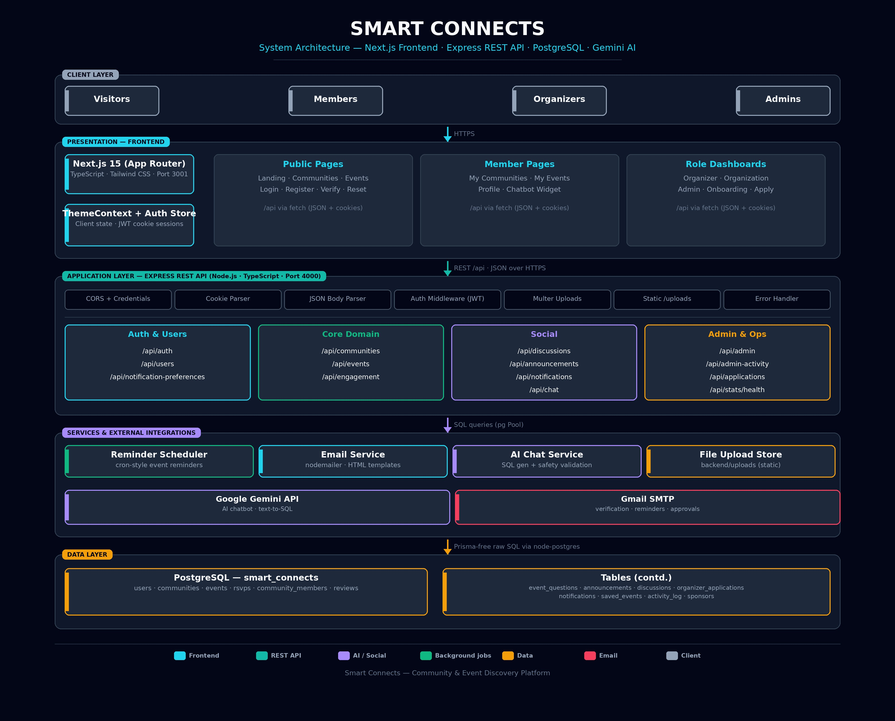

# Smart Connects — System Architecture



*Figure: Smart Connects system architecture — client layer through data layer with external integrations.*

---

## 1. Overview

Smart Connects is a full-stack community & event discovery platform built as three cooperating tiers plus external integrations:

| Tier | Technology | Role |
|------|------------|------|
| Presentation | **Next.js 15 (App Router)** + TypeScript + Tailwind CSS | UI, routing, client state |
| Application | **Node.js + Express** REST API (TypeScript) | Business logic, auth, file uploads, AI orchestration |
| Data | **PostgreSQL** (via `node-postgres` pool) | Persistence for all domain entities |
| External | **Google Gemini API**, **Gmail SMTP** | AI chatbot, transactional email |

The frontend runs on **port 3001**, the API on **port 4000**, and PostgreSQL on **5432**.

---

## 2. Client Layer

Four user roles interact with the system through the browser:

- **Visitors** — browse public communities, events, and landing page stats.
- **Members** — join communities, RSVP to events, post discussions, chat with the AI assistant.
- **Organizers** — manage communities, events, announcements, and registration approvals.
- **Admins** — review organizer applications, manage users, and monitor activity logs.

All traffic reaches the frontend over **HTTPS**; the frontend alone talks to the API.

---

## 3. Presentation Layer — Next.js Frontend

```
frontend/
├── app/                    # App Router pages (see index below)
├── app/lib/                # ThemeContext, auth/API helpers
└── app/components/         # Navbar, Sidebar, Chatbot widget, etc.
```

### Key page groups

| Group | Routes |
|-------|--------|
| Public | `/` landing, `/communities`, `/communities/[id]`, `/events`, `/events/[id]` |
| Auth | `/login`, `/register`, `/verify-email`, `/reset-password`, `/onboarding`, `/apply` |
| Member | `/my-communities`, `/my-events`, `/profile` |
| Organizer | `/organizer`, `/organization` |
| Admin | `/admin` |

### State & communication

- **JWT stored in an httpOnly cookie** — sent automatically with every request (`credentials: 'include'`).
- All data fetching is plain `fetch` calls returning **JSON** to the Express API.
- `ThemeContext` provides the dark/cyan glassmorphic theme across pages.

---

## 4. Application Layer — Express REST API

Entry point: `backend/src/index.ts`. The app wires CORS (allowing ports 3000/3001), cookie parsing, JSON body parsing, static serving of `/uploads`, and a global error handler, then mounts these routers:

| Router | Mount path | Responsibility |
|--------|-----------|----------------|
| `auth.ts` | `/api/auth` | Register, verify email, login, password reset |
| `users.ts` | `/api/users` | Profiles, avatars, interests |
| `communities.ts` | `/api/communities` | CRUD, membership, sponsors, banners |
| `events.ts` | `/api/events` | CRUD, RSVPs, registration questions, reminders |
| `engagement.ts` | `/api/engagement` | Saves, participation signals |
| `discussions.ts` | `/api/discussions` | Threaded community discussions |
| `announcements.ts` | `/api/announcements` | Community announcements |
| `notifications.ts` | `/api/notifications` | In-app notification feed |
| `notificationPreferences.ts` | `/api/notification-preferences` | Per-user channel settings |
| `chat.ts` | `/api/chat` | AI chatbot endpoint |
| `applications.ts` | `/api/applications` + `/api/admin/applications` | Organizer application workflow |
| `admin.ts`, `adminActivity.ts` | `/api/admin` | Admin dashboards, activity log |
| `recommendations.ts` | `/api/recommendations` | Personalized community/event suggestions |
| (inline) | `/api/stats`, `/api/health` | Public platform stats, DB health check |

### Cross-cutting services (`backend/src/`)

| Module | Role |
|--------|------|
| `db.ts` | `pg.Pool` connection manager (max 10 clients) |
| `email.ts` | Nodemailer transport + 15+ branded HTML templates |
| `reminderService.ts` | Background scheduler sending event-reminder emails |
| `notificationHelper.ts` | Shared notification-creation logic |
| `config/chat.ts` | Gemini system prompt, DB schema handoff, SQL safety validators |

---

## 5. Services & External Integrations

### 5.1 AI Chatbot (Gemini)

The chatbot at `/api/chat` works in **two passes**:

1. **SQL generation** — Gemini receives the system prompt + a compact database schema and emits a read-only `SELECT` query.
2. **Final answer** — the query is validated (`SELECT`/`WITH` only, single statement, `LIMIT` enforced), executed against PostgreSQL, and the results are fed back to Gemini to compose the user-facing reply with tables and action buttons.

Safety rails in `config/chat.ts`: forbidden-keyword rejection, semicolon truncation, result formatting into pipe tables.

### 5.2 Email (Gmail SMTP)

`email.ts` sends verification codes (10-min expiry), password resets, RSVP confirmations, event reminders, community join/leave notices, and application approvals/rejections. Without credentials configured it degrades to console logging (dev mode).

### 5.3 Reminder Scheduler

`reminderService.ts` runs inside the API process, periodically checks upcoming events, and triggers reminder emails through the email service. A manual trigger exists at `POST /api/admin/send-event-reminders`.

### 5.4 File Storage

Organizer documents, community banners, avatars, and RSVP attachments are uploaded via **Multer** into `backend/uploads/` and served statically at `/uploads`.

---

## 6. Data Layer — PostgreSQL

Database `smart_connects`, accessed exclusively through parameterized queries on a pooled connection.

| Domain | Tables |
|--------|--------|
| Identity | `users` |
| Communities | `communities`, `community_members`, `community_sponsors` |
| Events | `events`, `rsvps`, `event_questions`, `saved_events` |
| Social | `reviews`, `announcements`, `community_discussions` |
| Workflow | `organizer_applications` |
| Ops | `notifications`, `activity_log` |

Notable conventions: soft deletes via `deleted_at`, counter caches (`member_count`, `attendee_count`), and `JSONB` for RSVP custom-question answers.

---

## 7. Request Flow Example — RSVP to an Event

```
Member clicks "Attending"
  → Next.js page POSTs /api/events/:id/rsvp (cookie attached)
    → Express auth middleware validates JWT
      → events router checks capacity, deadline, custom questions
        → INSERT into rsvps (+ answers JSONB)
        → INSERT into notifications (notificationHelper)
        → sendEmail: RSVP confirmation via Gmail SMTP
      → 201 { rsvp } returned to the page
    → UI updates attendee count + confirmation toast
```

---

## 8. Deployment Topology

- `docker-compose.yml` / `docker-compose.local.yml` define the runtime containers.
- Per-service `Dockerfile`s exist for `frontend/` and `backend/`.
- `start.ps1` / `stop.ps1` orchestrate local startup/shutdown on Windows; `rebuild-docker.sh` rebuilds containers.
- CORS restricts origins to the configured frontend URL(s), and credentials (cookies) are required on every cross-origin call.
